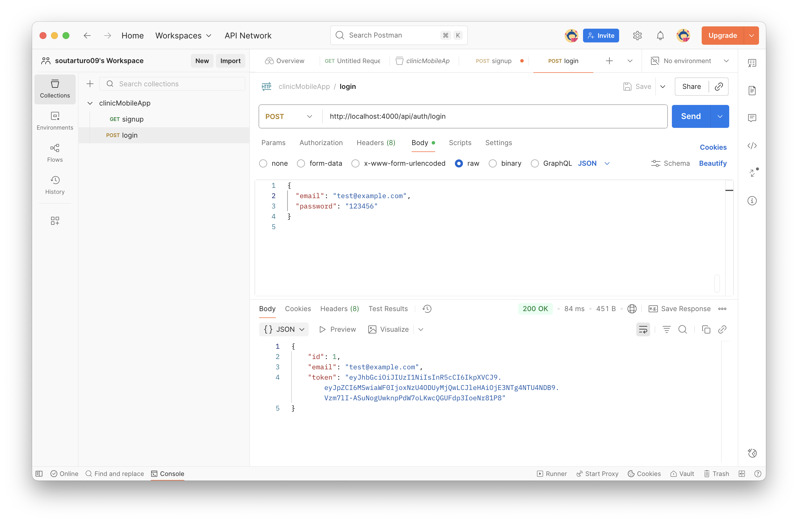
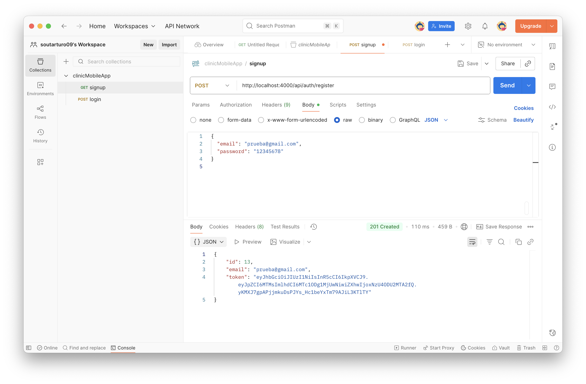

# Clinic App - Backend

## Descripción
Este repositorio contiene el backend de la aplicación de gestión de citas **Clinic App**. Incluye autenticación con JWT y endpoints para crear, editar, eliminar y listar citas.
---

## 🔧 Instalación y ejecución
NODE 20.19.0

1. Clonar el repositorio:
```bash
git clone https://github.com/tu-usuario/clinic-app-backend.git
cd clinic-app-backend
Instalar dependencias:
npm install
Crear archivo .env con variables de entorno necesarias:
PORT=4000
MONGO_URI=mongodb://localhost:27017/clinicapp
JWT_SECRET=tu_clave_secreta
Iniciar servidor:
npm run dev
El backend correrá en http://localhost:4000.

📦 Dependencias principales
express
mongoose
jsonwebtoken
bcryptjs
cors
dotenv

⚙️ Endpoints principales
Autenticación
POST /api/auth/register → Registro de usuario
POST /api/auth/login → Login y generación de JWT

Citas
GET /api/citas → Listar todas las citas
POST /api/citas → Crear nueva cita
PUT /api/citas/:id → Editar cita
DELETE /api/citas/:id → Eliminar cita

Ejemplo de uso con fetch en frontend:
const res = await fetch('http://localhost:4000/api/auth/login', {
  method: 'POST',
  headers: { 'Content-Type': 'application/json' },
  body: JSON.stringify({ email, password }),
});

const data = await res.json();

📸 Capturas de pantalla
### Login Backend


### Registro Backend



🔒 Seguridad
Principios aplicados:
Uso de HTTPS en producción.
Passwords encriptadas con bcrypt.
JWT para autenticar solicitudes.
Validación de datos antes de guardarlos en DB.
Amenazas identificadas y mitigación:
Riesgo de fuga de tokens → tokens no se almacenan en repositorio y se manejan en SecureStore/localStorage en frontend.
Inyección de datos → validamos datos antes de guardarlos en la base de datos.
Acceso no autorizado → endpoints protegidos mediante JWT.


Lineamientos para mantener seguridad:
No subir claves ni tokens al repositorio.
Usar variables de entorno para datos sensibles.
Validar y sanitizar datos en cada request.
Mantener dependencias actualizadas para evitar vulnerabilidades conocidas.