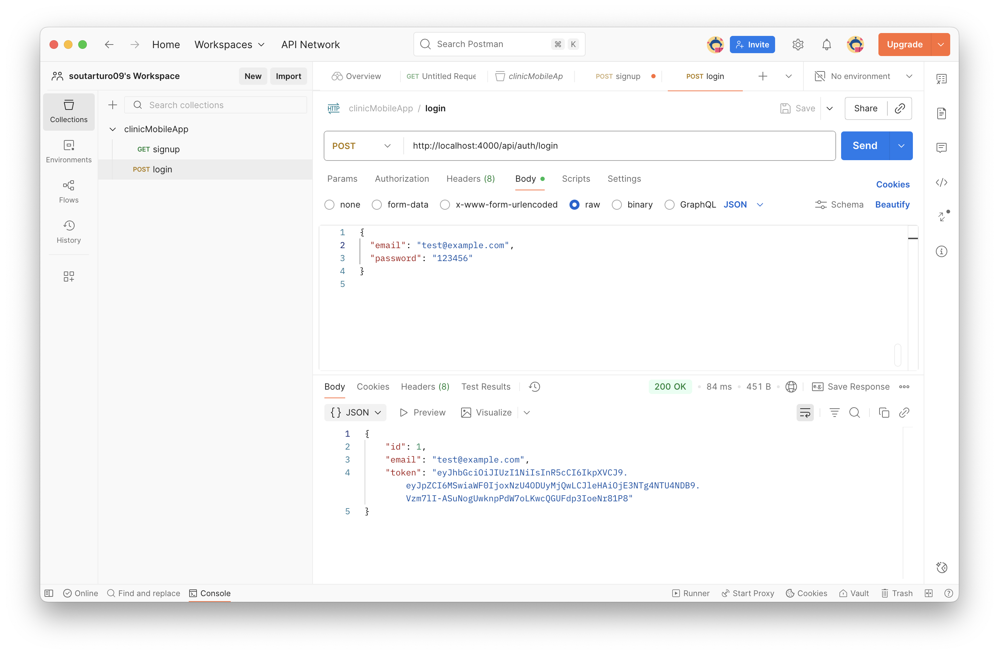
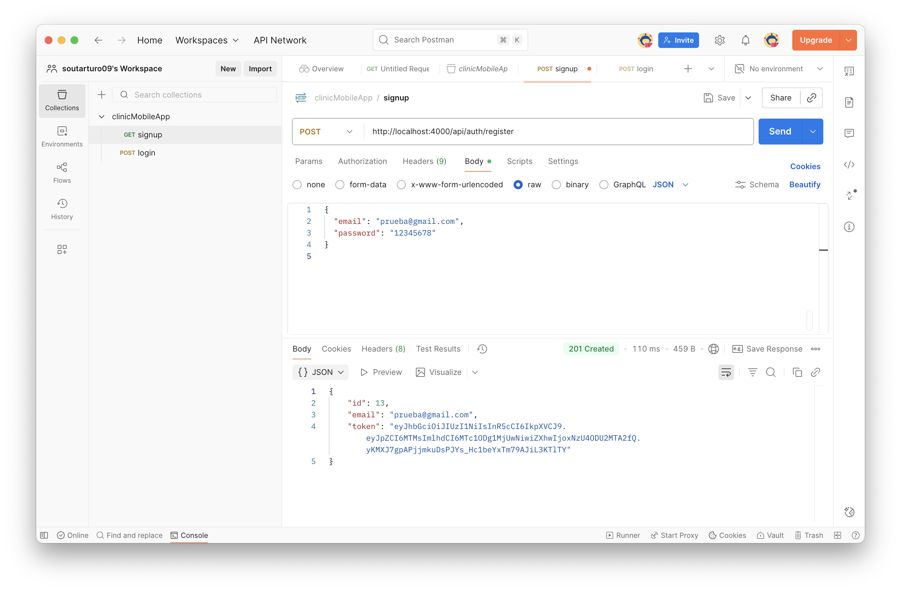

# Clinic App - Backend

## Descripción
Este repositorio contiene el backend de la aplicación de gestión de citas **Clinic App**. Incluye autenticación con JWT y endpoints para crear, editar, eliminar y listar citas.
---

## 🔧 Instalación y ejecución
NODE 20.19.0

1. Clonar el repositorio:
```bash
git clone https://github.com/tu-usuario/clinic-app-backend.git
cd clinic-app-backend
Instalar dependencias:
npm install
Crear archivo .env con variables de entorno necesarias:
PORT=4000
MONGO_URI=mongodb://localhost:27017/clinicapp
JWT_SECRET=tu_clave_secreta
Iniciar servidor:
npm run dev
El backend correrá en http://localhost:4000.

📦 Dependencias principales
express
mongoose
jsonwebtoken
bcryptjs
cors
dotenv

⚙️ Endpoints principales
Autenticación
POST /api/auth/register → Registro de usuario
POST /api/auth/login → Login y generación de JWT

Citas
GET /api/citas → Listar todas las citas
POST /api/citas → Crear nueva cita
PUT /api/citas/:id → Editar cita
DELETE /api/citas/:id → Eliminar cita

Ejemplo de uso con fetch en frontend:
const res = await fetch('http://localhost:4000/api/auth/login', {
  method: 'POST',
  headers: { 'Content-Type': 'application/json' },
  body: JSON.stringify({ email, password }),
});

const data = await res.json();

📸 Capturas de pantalla
### Login Backend


### Registro Backend



🧪 Pruebas Unitarias

### Descripción
El proyecto incluye un conjunto completo de pruebas unitarias implementadas con **Jest** y **Supertest** que cubren:
- ✅ Inserción y consulta de datos
- 🔥 Manejo de errores en operaciones de la nube
- 🔑 Autenticación y autorización de usuarios
- 🔍 Integración entre servicios

### Ejecutar las pruebas

1. **Instalar dependencias** (si no se han instalado):
```bash
npm install
```

2. **Ejecutar todas las pruebas**:
```bash
npm test
```

3. **Ejecutar pruebas con cobertura** (opcional):
```bash
npm test -- --coverage
```

4. **Ejecutar pruebas en modo watch** (desarrollo):
```bash
npm test -- --watch
```

### Resultados esperados
```
Test Suites: 1 passed, 1 total
Tests:       19 passed, 19 total
Snapshots:   0 total
Time:        ~2.5s
```

### Estructura de pruebas
```
__test__/
└── index.test.ts    # Archivo principal con todas las pruebas
```

### Categorías de pruebas incluidas:
- 📋 **Inserción y Consulta de Datos** (5 pruebas)
- 🔥 **Manejo de Errores en la Nube** (5 pruebas)  
- 🔑 **Autenticación de Usuarios** (6 pruebas)
- 🔍 **Integración de Servicios** (3 pruebas)

### Documentación completa
Para más detalles sobre el diseño e implementación de las pruebas, consulta:
📄 `Documentacion_Pruebas_Unitarias.txt`

---

🔒 Seguridad
Principios aplicados:
Uso de HTTPS en producción.
Passwords encriptadas con bcrypt.
JWT para autenticar solicitudes.
Validación de datos antes de guardarlos en DB.
Amenazas identificadas y mitigación:
Riesgo de fuga de tokens → tokens no se almacenan en repositorio y se manejan en SecureStore/localStorage en frontend.
Inyección de datos → validamos datos antes de guardarlos en la base de datos.
Acceso no autorizado → endpoints protegidos mediante JWT.


Lineamientos para mantener seguridad:
No subir claves ni tokens al repositorio.
Usar variables de entorno para datos sensibles.
Validar y sanitizar datos en cada request.
Mantener dependencias actualizadas para evitar vulnerabilidades conocidas.